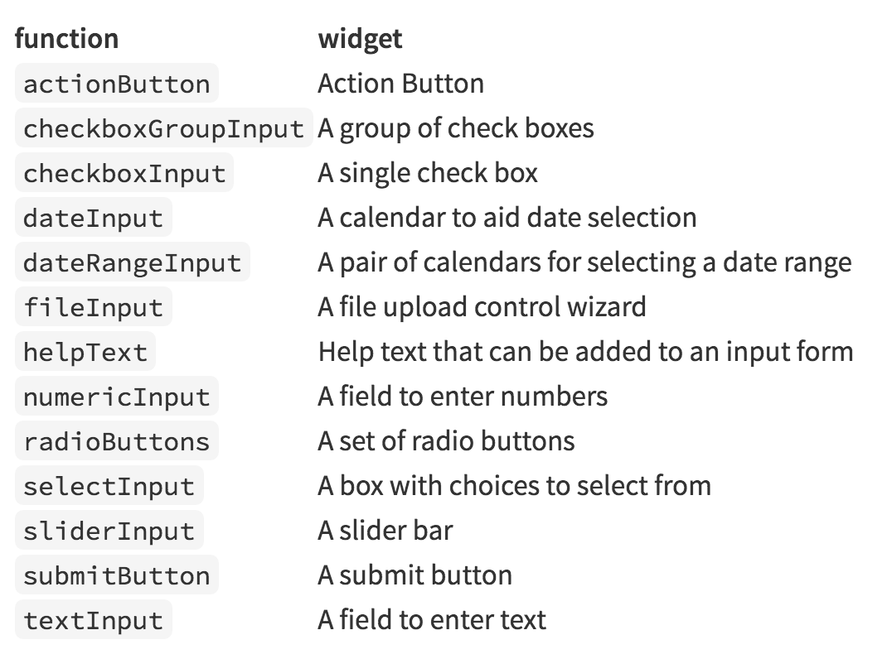

# Speaker

## About me 

<center>
</img>
</center>

### Alger Yang, M.S , NCCU

- 角色：
    - 菜鳥資料分析師
    - 資料視覺化愛好者
    - 中華民國替代役訓練班第168T
- 常用工具：
    - R、SQL、SPSS、...
- 過去與現在工作：
    - DSP實習研究員
    - 健保資料庫的資料分析
    - 塩洲里活動中心管理員
    
# 正片開始

## 為什麼需要Shiny？ {.columns-2}

### 以我為例...

<br>

>- 遇上一個難以捉摸的老闆時...
>- 專案進入最後階段的時候...
>- 使一堆數學式、數據、統計量、估計式動起來**Q.Q**
>- 能作為廣告效益監測、資料品質檢驗等資料科學應用的好工具

<center>
</img>
</center>
    
## 什麼是Shiny？

- Rstudio這間公司在2012年釋出的R套件，時至今日Shiny已經四歲了，許多地方也做了不少更新與改善
- Shiny是一個用於開發web app的**R**套件
- 支援基本的表格、圖片、各種統計圖表、地圖與建模結果的視覺化呈現

<center>
</img>
</center> 

## Shiny的特色是？{data-background="c.jpeg"}

- Only **R**
- 程式撰寫的模式規律(很容易撰寫)
- 以互動的方式讓使用者更容易的暸解許多複雜的分析結果
- Shiny可以完全依賴**R**就能完成一個互動式網頁(or Dashboard)，同時也支援
HTML/CSS/Javascript/Markdown etc
- 支援許多視覺化套件例如：Leaflet、dygraphs、Plotly、Highcharter、Datatable、ggplot2、、...等等
- 搭配dplyr、tidyr、DT、data.table等資料整理套件合用，會得到意想不到的爽感～

<center>
</img>
</center> 

## 如何執行Shiny apps？{.columns-2}

1. 學習shiny，先從範例模仿
    + 從Rstudio建立shiny apps:
    + step1 Create Project
    + step2 選 Shiny Web Application
    + step3 檔案目錄代表app名稱
2. 載入已建立好的apps(即目錄名稱)
3. runApp

<center>
</img>
</center>

## 開啟shiny專案-Step1

<center>
</img>
</center> 

## 開啟shiny專案-Step2

<center>
</img>
</center> 

## 開啟shiny專案-Step3

<center>
</img>
</center> 

# 安裝與運作原理

## 安裝與運行

```{r, echo=TRUE,eval=FALSE}
install.packages("shiny") #安裝
library(shiny) #載入
runExample("01_hello")
```

```{r, echo = FALSE}
shinyUI(fluidPage(

  # Application title
  titlePanel("Hello Shiny!"),

  # Sidebar with a slider input for the number of bins
  sidebarLayout(
    sidebarPanel(
      sliderInput("bins",
                  "Number of bins:",
                  min = 1,
                  max = 50,
                  value = 30)
    ),

    # Show a plot of the generated distribution
    mainPanel(
      plotOutput("distPlot")
    )
  )
))

  # Expression that generates a histogram. The expression is
  # wrapped in a call to renderPlot to indicate that:
  #
  #  1) It is "reactive" and therefore should be automatically
  #     re-executed when inputs change
  #  2) Its output type is a plot

  output$distPlot <- renderPlot({
    x    <- faithful[, 2]  # Old Faithful Geyser data
    bins <- seq(min(x), max(x), length.out = input$bins + 1)

    # draw the histogram with the specified number of bins
    hist(x, breaks = bins, col = 'darkgray', border = 'white')
  })
```


## 網頁應用的運作原理

- 客戶端：
    + 瀏覽器進行畫面呈現
    + 瀏覽器和使用者進行互動
        + 依據互動的過程，瀏覽器隨時會和伺服器交換資料
            + 瀏覽器發出Request
            + 伺服器回傳Response
- 伺服器端：
    + 伺服器提供畫面的規格給瀏覽器
    + 伺服器再依據瀏覽器提供的資訊，回傳使用者需要的資料

## Shiny的運作原理 

- 基本架構
    + ui.R: 客戶端，負責前端使用者介面的呈現
    + server.R: 伺服器端，負責後端資料處理與計算
    
<center>
</img>
</center>

<center>
</img>
</center>

## 每個**widget**都有其在**R**中對應的function

<br>

<center>
</img>
</center> 

<center>
</img>
</center> 


## 讓我們稍微看看hello shiny的**ui.r**{.columns-2}

### **ui.r**

<center>
</img>
</center> 

### 說明：

- shiny 會將 ui.R的R 物件轉換為HTML、CSS和Javascript，透過瀏覽器呈現
- 透過Javascript，瀏覽器會將使用者的動作轉換為Request發回給Server
- library(shiny)載入shiny套件
- shinyUI：它之中的物件都是shiny UI物件
- fluidPage：整個瀏覽器頁面的容器
- titlePanel、sidebarPanel和mainPanel

## 讓我們稍微看看hello shiny的**server.r**{.columns-2}

### **server.r**

<center>
</img>
</center> 

### 說明：

- Shiny server處理瀏覽器傳來的Request，轉化為R 中的input
- 我們撰寫R 函數將input轉換為output
- Shiny server再把output轉換為Response傳回瀏覽器
- library(shiny)載入Shiny
- shinyServer：定義伺服器端的邏輯
- function(input, output) {...}:一段自Request產生Response的邏輯

## 如何發布Shiny apps？

1. Login with Google or Github
2. get token: setAccountInto(name,token,secret)
3. deployApp(appDir="appdir_name", appName = "Name_at_shinyapps")
4. [Rstudio提供的雲端頁面基本介紹](http://shiny.rstudio.com/)

### Bonus 

- [ShinyDashboard](https://rstudio.github.io/shinydashboard/)
- [Show Me Shiny](http://www.showmeshiny.com/)
- [粉紅高壓電(Pinky Power)](https://github.com/Lofu/Power_HackathonAsia-Competition)


## Shiny編輯的小雜談

<br>

- 刻Shiny的**時間成本**
    + ui...
    + color...

- 我的角色
    + 也許我該專注在如何提高模型預測的**Accuracy**
    
- The nice visualization is：
    + 能夠完整表達出資料與分析結果所隱含的資訊
    + 使接收者快速的理解並印象深刻
    
## {.columns-2}

### **敬昇：**

### Shiny套件在R軟體中發展的相當迅速，我認為Shiny在資料科學流程中，已經扮演著舉足輕重的角色，它可以將資料所蘊含的價值透過簡單地方式做呈現，即便是沒有參與資料分析的過程，也可以享有其成果。舉凡：廣告投放成效的監測、資料儀表板的應用、資料品質的檢驗，Shiny都可以作為很好的工具去實現。

<center>
</img>
</center> 


